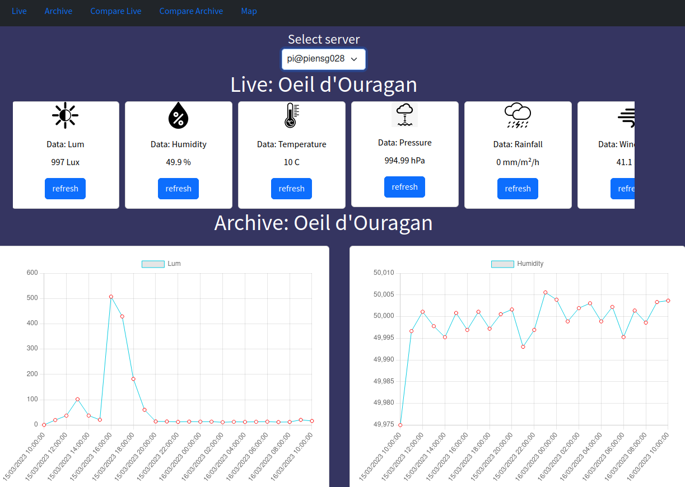

# Oeil Ouragan

[](LICENSE)
[](https://github.com/username/repo/issues)
[](https://github.com/username/repo/stargazers)

 The goal is to realize the software part of a weather station composed of sensors and a central. Each probe is connected to several sensors that give various information:

    Temperature
    Hygrometry
    Atmospheric pressure
    Rainfall
    Luminosity
    Wind speed and direction
    GPS position and time
    ...

A weather station can be subscribed to several probes and presents the data of these probes.

# Table of Contents

- [Project access](#projectaccess)
- [Installation](#installation)
- [SystemD](#systemd)
- [License](#license)
- [Useful links](#usefullinks)

## Project access

### URL: piensg028:3000/ 
(works only at our school)
    - go to this url (http://piensg028:3000) to test the app 


.

## Installation

### Front: 
(There is a readme in the front folder)

```cmd
git clone https://gitlab.com/kingatsa/oeil-ouragan-project.git #clone
npm install -g @vue/cli  #(install vue if not exist)
```
In the project folder:
```cmd
cd ./front-ouragan #(go to this folder in the terminal)
npm install #(install dependancies)
npm run serve #(run server)
```

In a browser, open localhost:8080/

To use the mock server, run the mock server on localhost:3000
tmock server has been deleted

#### Observation: 
    - the front vue project has been compressed with the build command and put in the public folder of the express project 
    - for live and archvie:
        - if the server is down or if the json sent by the api does not follow the norme written in swager, you will have this error (and if the response is slow, you will see this signal for a second): 

.

    - for comparaison: 
        - bewteen servers api if one of the server api do not work properly, the comparaison won't work.
        - if you don't see the data, refesh the card with refresh button 

### SERVER
 1- Install expresss

 2- Install no demon 
install nodemon for restarting the node application when file changes i

```cmd
    npm install --save-dev nodemon
```
-   change node to nodemon in package.json

 3- Install mongo
Install mongodb  using docker:
```cmd
    docker run -d --name mongoOuragan -p 27017:27017 mongo
```
 4- To save the data
In the project folder:
```cmd
    cd ./load #(go  to this folder in the terminal)
    npm i #(install dependancies)
```

 5- To run the express server
In the project folder:
```cmd
    cd ./serverOeilOuragan/expressServerOeilOuragan #(go  to this folder in the terminal)
    npm i #(install dependancies)
```

## SytemD

### Back server Daemon
The following command generates a daemon which goal is to run a server for retrieving data

```cmd
cat << 'EOF' | sudo tee /etc/systemd/system/ouragan.service
[Unit]
Description=weather fake data generator

[Service]
WorkingDirectory=/home/pi/projet/API/oeil-ouragan-project/serverOeilOuragan/expressServerOeilOuragan
#ExecStartPre=/usr/bin/npm install
ExecStart=/usr/bin/npm run dev

[Install]
WantedBy=multi-user.target
EOF
```
To start the demon
```cmd
    sudo systemctl enable ouragan.service
    sudo systemctl start ouragan.service
```


### Back server Load data
The following command generates a daemon which goal is load data to the database

```cmd
cat << 'EOF' | sudo tee /etc/systemd/system/load.service
[Unit]
Description=weather fake data generator

[Service]
WorkingDirectory=/home/pi/projet/API/oeil-ouragan-project/load
#ExecStartPre=/usr/bin/npm install
ExecStart=/usr/bin/npm run load

[Install]
WantedBy=multi-user.target
EOF
```
To start the demon
```cmd
    sudo systemctl enable load.service
    sudo systemctl start load.service
```

## License
This project is licensed under the MIT License - see the [LICENSE](LICENSE) file for details.


## Useful links
### Front
- Vue charts [link](https://vue-chartjs.org/)

- Vue charts examples [link](https://vue-chartjs.org/examples/)

- Compoment vue exemple [link](https://vuestic.dev/en/introduction/overview)

### Back

- How to Insert Data into MongoDB with Node.js and Mongoose [link](https://technoapple.com/blog/post/How-to-Insert-Data-into-MongoDB-with-Node.js-and-Mongoose)

- Getting Started with MongoDB & Mongoose [link](https://www.mongodb.com/developer/languages/javascript/getting-started-with-mongodb-and-mongoose/)


